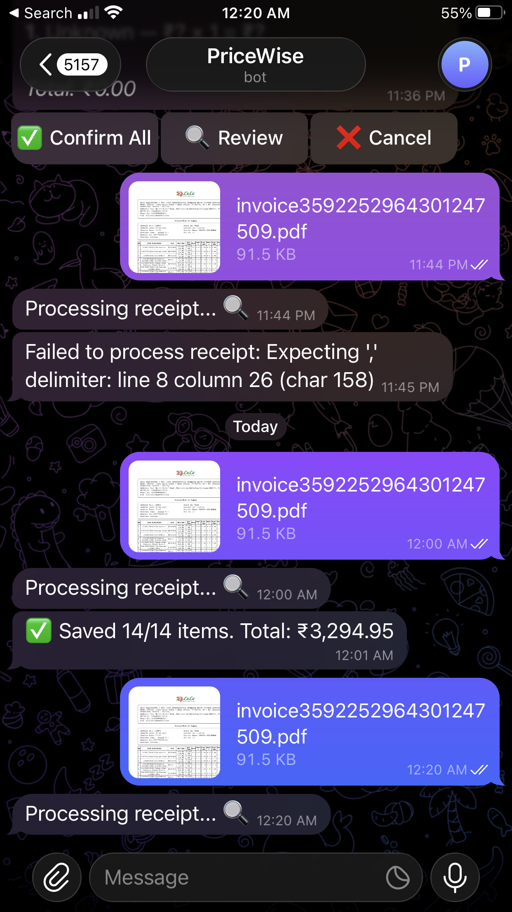
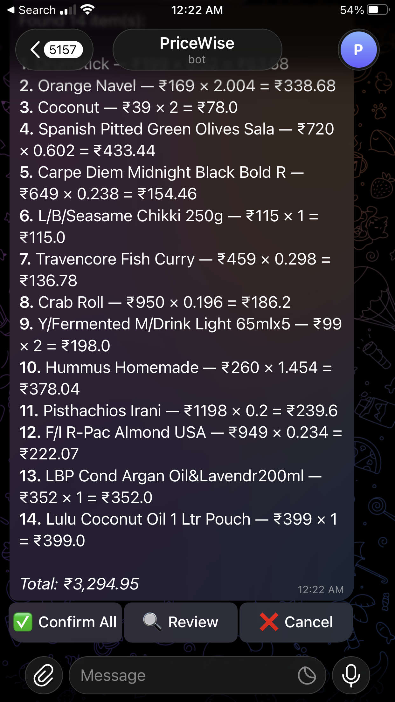
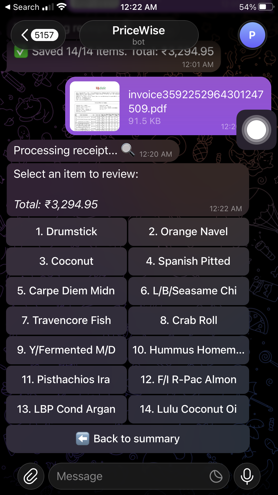
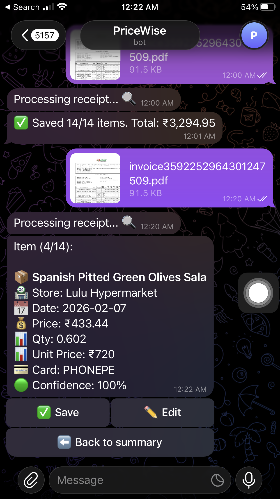
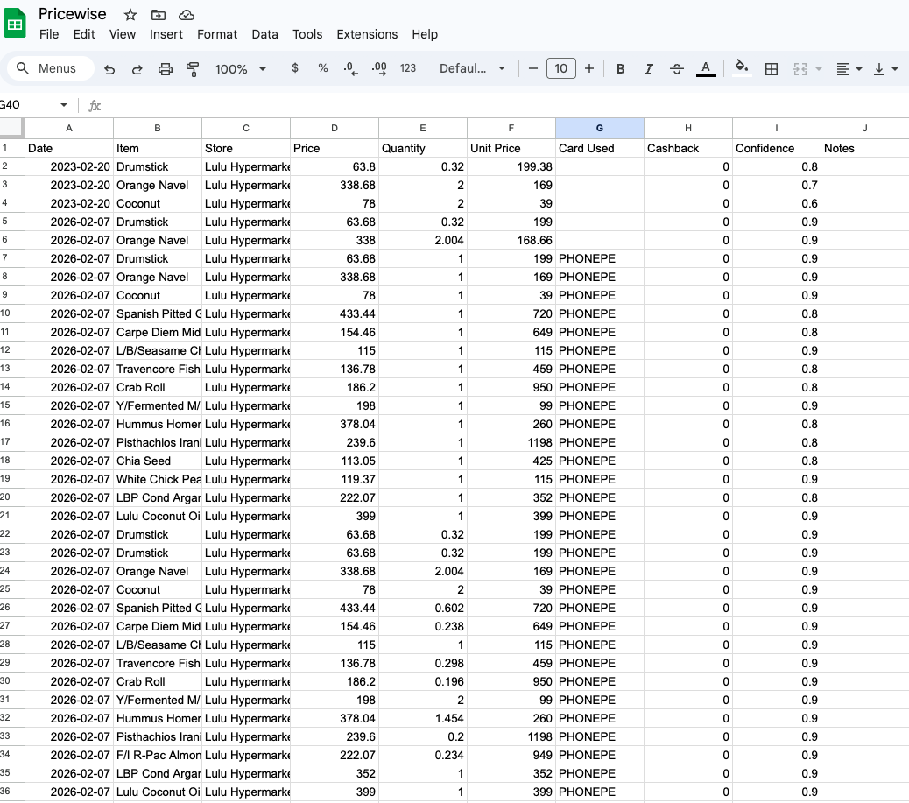

# PriceWise

A Telegram bot that extracts purchases from receipt photos and tracks prices in Google Sheets.
Send a photo of any receipt — the bot runs dual OCR, parses items with an LLM, and lets you review
and save them with a single tap. Look up price history or check whether a quoted price is a good deal.

---

## Example Output

<div align="center">
  
  <p><em>Uploading a PDF receipt — the bot extracts text via dual OCR</em></p>
</div>

<div align="center">
  
  <p><em>Parsed line items shown as a summary with confidence indicators</em></p>
</div>

<div align="center">
  
  <p><em>Item picker for reviewing individual entries before saving</em></p>
</div>

<div align="center">
  
  <p><em>Detailed view with inline editing for any field</em></p>
</div>

<div align="center">
  
  <p><em>Purchases logged automatically to Google Sheets</em></p>
</div>

---

## Usage

**Send a receipt** — photo, full-resolution image, or PDF. The bot extracts all line items and asks
for confirmation before saving.

**Describe a purchase in text:**
```
Bought eggs ₹60 at DMart
```

**Bot commands:**

| Command | Description |
|---|---|
| `/best <item>` | Show price history for an item (min / max / avg) |
| `/deal <price> <item>` | Check whether a price is good, fair, or expensive |
| `/cancel` | Discard the current pending entry |

---

## Setup

### 1. Install dependencies

```bash
pip install -r requirements.txt
```

### 2. Configure environment

Create a `.env` file:

```env
TELEGRAM_TOKEN=your_telegram_bot_token
SHEETS_ID=your_google_spreadsheet_id
ALLOWED_USER_IDS=123456789,987654321   # optional; leave blank to allow all

# LLM — set one of the following:
ANTHROPIC_API_KEY=your_anthropic_key   # uses Claude if set
OLLAMA_BASE_URL=http://localhost:11434 # fallback when key is absent
OLLAMA_MODEL=llama3.2
```

### 3. Authenticate with Google

Place your OAuth client credentials at `oauth_credentials.json`, then run:

```bash
python google_auth.py
```

This opens a browser prompt and writes `token.json`.

### 4. Run

```bash
python bot.py
```
